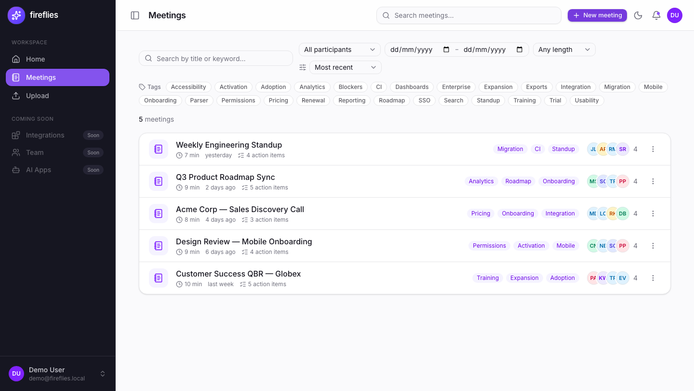
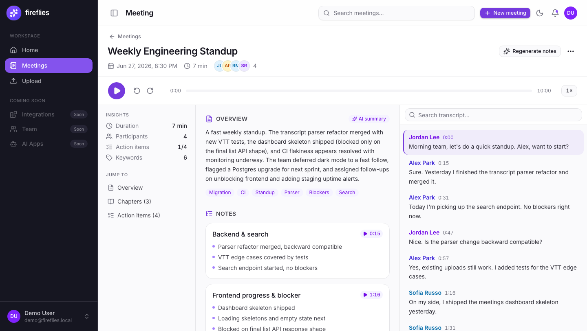
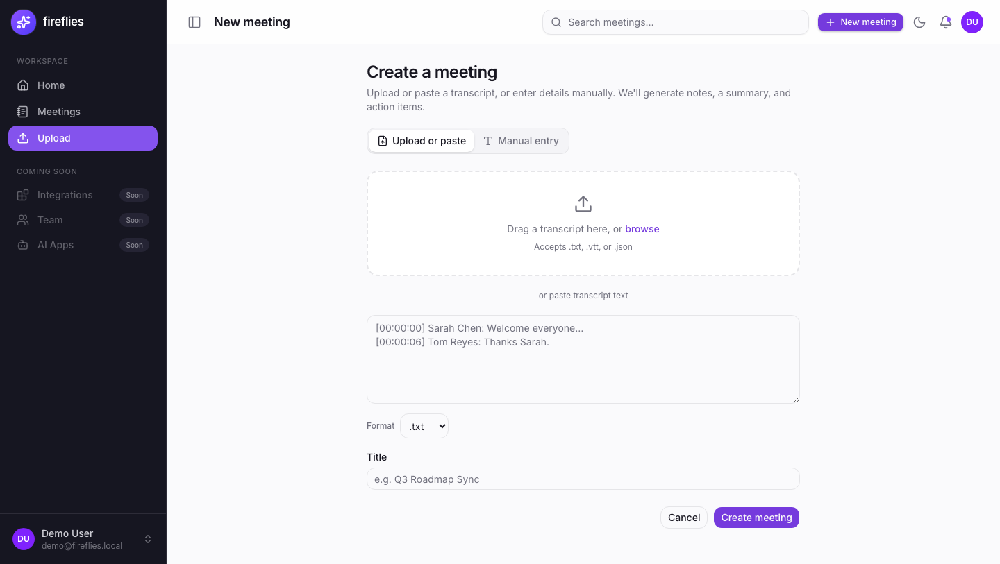
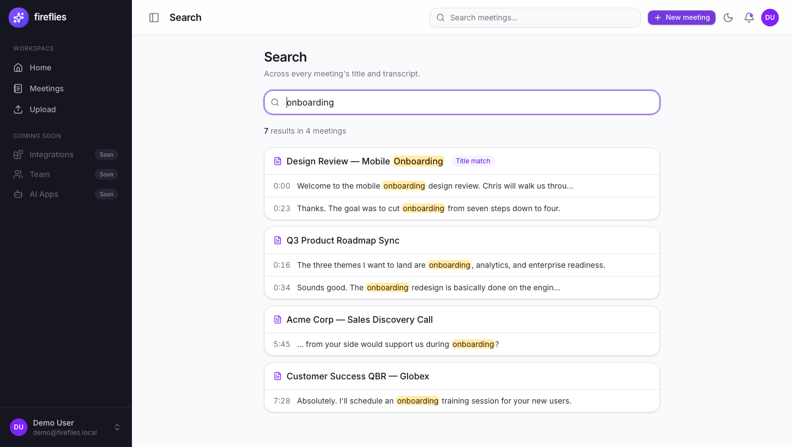
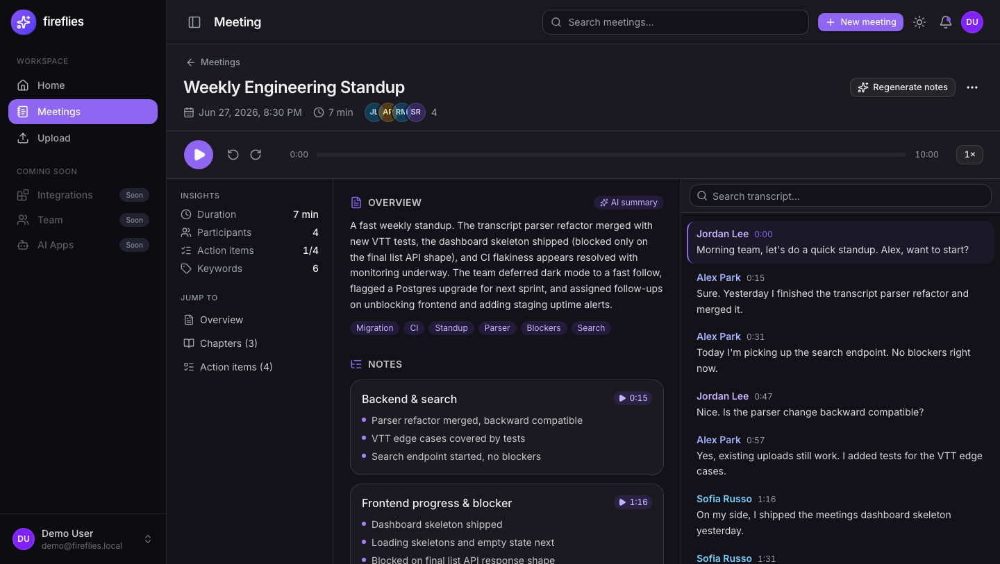

# Fireflies.ai Clone

A full-stack meeting-assistant clone: a meetings dashboard, an interactive
**Notepad** detail page (media player ↔ transcript ↔ summary two-way sync),
AI-style summaries and action items, a create flow that parses uploaded/pasted
transcripts, global search, export, tag filtering, dark mode, and an optional
AI Q&A panel.

> Speech-to-text is **mocked** — transcripts come from uploaded/pasted files or
> seed data. See [Assumptions](#assumptions).

## Screenshots

**Meetings dashboard** — search, filters, tag chips, participant avatars.


**Notepad** — media player, AI summary + chapters + action items, and the
interactive transcript that two-way-syncs with the player.


**Create a meeting** — upload or paste a transcript (`.txt`/`.vtt`/`.json`), or enter it manually.


**Global search** — across every meeting's title and transcript.


**Dark mode** — cookie-persisted theme toggle.


## Tech stack

| Layer | Choice |
|---|---|
| Frontend | Next.js 16 (App Router) + TypeScript, React 19 |
| Styling | Tailwind CSS v4 + shadcn/ui (Base UI primitives) + lucide-react |
| Data fetching | TanStack Query (React Query) v5 |
| Backend | Python 3.13 + FastAPI |
| ORM / schemas | SQLAlchemy 2.0 + Pydantic v2 |
| Migrations | Alembic |
| Database | SQLite (`backend/fireflies.db`) |
| Audio | static `frontend/public/sample-audio.mp3` + HTML5 `<audio>` |
| LLM (optional) | Anthropic / OpenAI via env key, graceful fallback to a seeded mock |

## Architecture

```
┌─────────────────────────────┐        HTTPS / JSON         ┌──────────────────────────────┐
│  Next.js 16 (App Router)     │  ── GET/POST/PATCH/DELETE ─▶ │  FastAPI                      │
│  - /meetings  dashboard      │     /api/...                │  routers → crud → SQLAlchemy  │
│  - /meetings/[id]  Notepad   │ ◀── JSON (Pydantic models) ─ │  services: transcript_parser, │
│  - /meetings/new  create     │                             │            summarizer, qa     │
│  - /search, /settings        │   NEXT_PUBLIC_API_BASE_URL  │            │                  │
│  TanStack Query · cookie     │                             │            ▼                  │
│  theme · client components   │                             │   SQLite (fireflies.db)       │
└─────────────────────────────┘                             └──────────────────────────────┘
        Vercel                                                   Render / Railway
```

- The frontend is a client-rendered SPA-style App Router app; all data is fetched
  client-side via TanStack Query against the FastAPI base URL.
- Route handlers are thin: they validate input and delegate to `crud` (DB ops) and
  `services` (parsing, summarizing, Q&A). No ORM objects cross the API boundary —
  every response is a Pydantic model.

## Database schema

UUID string PKs throughout. A meeting has many participants / transcript segments /
keywords / action items, and **one** summary (1:1); a summary has many chapters.
`cascade="all, delete-orphan"` + SQLite `PRAGMA foreign_keys=ON` clean up children
when a meeting (or summary) is deleted.

```
users(id, name, email, avatar_url, created_at)
  └─1:N─ meetings.organizer_id

meetings(id, title, description, date, duration_seconds, audio_url,
         language, organizer_id→users, created_at, updated_at)
  ├─1:N─ participants(id, meeting_id→meetings, name, email, speaker_label)
  ├─1:N─ transcript_segments(id, meeting_id→meetings, speaker, start_ms,
  │                          end_ms, text, idx)        # index (meeting_id, idx)
  ├─1:N─ keywords(id, meeting_id→meetings, term)
  ├─1:N─ action_items(id, meeting_id→meetings, text, assignee, completed,
  │                   start_ms, created_at, updated_at)
  └─1:1─ summaries(id, meeting_id→meetings [unique], overview, generated_by,
                   created_at, updated_at)
           └─1:N─ summary_chapters(id, summary_id→summaries, title,
                                   bullets_json, start_ms, idx)
```

8 tables: `users`, `meetings`, `participants`, `transcript_segments`, `summaries`,
`summary_chapters`, `keywords`, `action_items`. Migration: `backend/alembic/versions/`.

## API overview

| Method | Path | Purpose |
|---|---|---|
| GET | `/api/me` | The single default user |
| GET | `/api/health` | Health check |
| GET | `/api/meetings` | List meetings (query: `q`, `participant`, `keyword`, `date_from`, `date_to`, `min_duration`, `sort`) |
| GET | `/api/meetings/{id}` | Full detail: meeting + participants + segments + summary(+chapters) + keywords + action items |
| POST | `/api/meetings` | Create from JSON (inline segments or pasted `transcript_text` + `transcript_format`) |
| POST | `/api/meetings/upload` | Create from an uploaded `.txt`/`.vtt`/`.json` file (multipart) |
| PATCH | `/api/meetings/{id}` | Edit metadata / participants |
| DELETE | `/api/meetings/{id}` | Delete (cascades) |
| POST | `/api/meetings/{id}/regenerate-summary` | Re-run the summarizer |
| GET | `/api/meetings/{id}/transcript` | Segments only |
| POST | `/api/meetings/{id}/transcript/search?q=` | In-meeting matches + char offsets |
| GET | `/api/search?q=` | Global search across titles + transcript text |
| GET | `/api/meetings/{id}/action-items` · POST | List / create action items |
| PATCH · DELETE | `/api/action-items/{id}` | Edit (toggle/text/assignee) / delete |
| GET | `/api/ai/status` | Whether AI Q&A is enabled (LLM key present) |
| POST | `/api/meetings/{id}/ask` | Ask a question about a meeting (503 if no key) |

Interactive docs at `/docs` when the backend is running.

## Local setup

Prerequisites: **Python 3.11+** and **Node 20+** (built on Python 3.13 / Node 22).

### Backend (`backend/`)

```bash
cd backend
python3 -m venv venv
source venv/bin/activate           # Windows: venv\Scripts\activate
pip install -r requirements.txt
alembic upgrade head               # create the SQLite schema
python -m app.seed                 # seed 5 demo meetings (idempotent: wipes + reseeds)
uvicorn app.main:app --reload --port 8000
```

Backend runs at `http://localhost:8000` (docs at `/docs`).

### Frontend (`frontend/`)

```bash
cd frontend
npm install
echo "NEXT_PUBLIC_API_BASE_URL=http://localhost:8000" > .env.local
npm run dev
```

Frontend runs at `http://localhost:3000`.

## Environment variables

| Var | Side | Required | Purpose |
|---|---|---|---|
| `NEXT_PUBLIC_API_BASE_URL` | frontend | yes (deploy) | Backend base URL. Defaults to `http://localhost:8000`. |
| `CORS_ORIGINS` | backend | deploy | Comma-separated extra allowed origins (e.g. the Vercel URL). localhost:3000 is always allowed. |
| `ANTHROPIC_API_KEY` *or* `OPENAI_API_KEY` | backend | optional | Enables the LLM summarizer + AI Q&A. Absent → deterministic offline mock; Q&A panel shows its disabled state. |
| `LLM_MODEL` | backend | optional | Override the model id (defaults: `claude-sonnet-4-6` / `gpt-4o-mini`). |

## Seeding

`python -m app.seed` is **idempotent**: it wipes all rows and inserts 5 rich demo
meetings (participants, 30–34 transcript segments, summaries with chapters, action
items). It also runs `Base.metadata.create_all`, so it works on a fresh database.

## Deployment

See [DEPLOY.md](DEPLOY.md) for the full step-by-step. Summary:

- **Backend → Render / Railway** (FastAPI + SQLite). SQLite is ephemeral and resets
  on redeploy, so the start command **reseeds on boot** to guarantee the 5 demo
  meetings are always present:
  `python -m app.seed && uvicorn app.main:app --host 0.0.0.0 --port $PORT`.
  Set `CORS_ORIGINS` to the deployed frontend URL.
- **Frontend → Vercel** (root directory `frontend/`). Set
  `NEXT_PUBLIC_API_BASE_URL` to the deployed backend URL.
- **AI Q&A is deployed keyless by design** (the keyed answering path is unverified):
  the chat shows its clean disabled state and everything else works. Set
  `ANTHROPIC_API_KEY` on the backend to enable it.

## Assumptions

- **Single default user.** There is no real auth yet; the backend serves one
  implicit user via `GET /api/me`, and the frontend treats it as the logged-in
  account. Team/sharing/SSO are "Coming soon" placeholders.
- **Speech-to-text is mocked.** Transcripts come from uploaded/pasted files or
  seed data — there is no real audio transcription. Live bot/STT is a placeholder.
- **`.json` transcript timestamp convention.** When parsing `.json` transcripts,
  `start_ms` / `end_ms` are read as **milliseconds**, while `start` / `end` are
  read as **seconds** (the common ASR-export convention) and scaled to ms.
  `speaker`/`name` and `text`/`content` keys are both accepted.
  (See `backend/app/services/transcript_parser.py`.)
- **Sample-audio duration contract (600s).** Every meeting plays the same static
  `frontend/public/sample-audio.mp3`. Seed timestamps are bounded below
  `SAMPLE_AUDIO_DURATION_SECONDS = 600` (`backend/app/seed.py`) so every
  transcript line, chapter, and action item is seekable and the player seek-bar
  lines up. The committed sample mp3 is a real **10:00** clip, which satisfies
  the contract; swapping in any clip ≥ 600s keeps the alignment valid.
- **LLM features are optional.** The summarizer runs an offline deterministic mock
  by default; the Anthropic/OpenAI path (summaries + AI Q&A) activates only if an
  API key env var is set and degrades back to the mock / disabled state on any
  failure — so the demo never depends on an LLM key.
- **Deployed SQLite is ephemeral.** It resets on redeploy and is reseeded on boot,
  so runtime-created meetings don't persist across deploys on the hosted demo.
```
